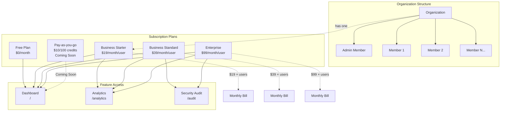

# Nextjs SaaS demo

## Getting Started

First, run the development server:

```bash
npm run dev
```

Open [http://localhost:3000](http://localhost:3000)

## Features

### Core Features
- **Authentication**: [Clerk](https://clerk.com/) with Google OAuth and email/password login
- **Organization Management**: Multi-tenant organization structure with member management
- **Billing**: [Clerk Billing](https://clerk.com/docs/billing) powered by Stripe
- **UI Components**: [ShadCN/UI](https://ui.shadcn.com/) for modern, responsive design
- **Service Name**: **Nextjs SaaS Demo**

### Subscription Plans & Features

| Plan | Price | Features | Page Access |
|------|-------|----------|-------------|
| **Free** | $0/month | • Landing page<br>• Basic dashboard<br>• Organization management | `/` (dashboard) |
| **Business Starter** | $19/month/user | • All Free features<br>• Analytics dashboard<br>• Advanced reporting | `/analytics` |
| **Business Standard** | $39/month/user | • All Business Starter features<br>• Security audit tools<br>• Compliance reports | `/analytics`<br>`/audit` |
| **Enterprise** | $99/month/user | • All Business Standard features<br>• Priority support<br>• Custom integrations | All features |
| **Pay-as-you-go** | $10/100 credits | • Coming Soon<br>• Credit-based usage<br>• Max 5 members | Coming Soon |

### Organization & Subscription Structure



### Page Structure
- **Landing Page** (`/`): Marketing page for non-authenticated users
- **Dashboard** (`/` after login): Main dashboard with organization overview
- **Analytics** (`/analytics`): Business analytics and reporting (Business Starter+)
- **Security Audit** (`/audit`): Security audit tools and compliance (Business Standard+)
- **Authentication Pages**: Sign-in/sign-up with Google OAuth and email/password

## Setup

Follow these steps to set up the Next.js SaaS Demo application:

### Prerequisites

- Node.js 18+ and npm/pnpm installed
- A [Clerk](https://clerk.com) account for authentication and billing

### 1. Clone and Install Dependencies

```bash
npm install
```

### 2. Environment Variables

Copy the example environment file and update with your keys:

```bash
cp .env.example .env.local
```

The required environment variables are:

```env
NEXT_PUBLIC_CLERK_PUBLISHABLE_KEY=pk_test_your_key_here
CLERK_SECRET_KEY=sk_test_your_key_here
```

### 3. Set Up Authentication & Billing (Clerk)

Follow the detailed guide in [docs/clerk-setup.md](docs/clerk-setup.md) to:

1. Create a Clerk application
2. Configure Google OAuth  
3. Set up Clerk Billing (for production, you'll need to connect your own Stripe account)
4. Copy your API keys to the `.env.local` file created above

**Development vs Production:**
- **Development**: No Stripe setup required - Clerk Billing works in test mode
- **Production**: You'll need to set up your own Stripe account and integrate it with Clerk Billing

### 4. Run the Application

```bash
# Development mode
npm run dev

# Build for production
npm run build
npm start
```

### 5. Test the Application

1. Visit `http://localhost:3000`
2. Sign up using email/password or Google OAuth
3. Explore the dashboard
4. Try accessing `/analytics` or `/audit` (requires subscription)
5. Test the subscription flow using Clerk's billing features

## Project Structure

```
src/
├── app/
│   ├── (auth)/          # Authentication pages
│   ├── analytics/       # Business analytics (Business Starter+)
│   ├── audit/          # Security audit (Business Standard+)
│   ├── api/            # API routes
│   └── page.tsx        # Landing/Dashboard
├── components/         # React components
├── lib/               # Utilities and configurations
└── middleware.ts      # Clerk authentication middleware
```

## Troubleshooting

- **Authentication issues**: Check Clerk API keys and configuration
- **Billing issues**: Verify Clerk Billing setup and subscription configuration
- **Build errors**: Ensure all environment variables are set
- **Feature access**: Check subscription status and plan limits in Clerk Dashboard

## Features Implemented ✅

- **Authentication**: Clerk with Google OAuth and email/password
- **UI Components**: ShadCN/UI components (Button, Card, Avatar, Dropdown Menu)
- **Responsive Design**: Mobile-first, clean white theme
- **Landing Page**: Marketing page for non-authenticated users
- **Dashboard**: User dashboard with account overview
- **Subscription Tiers**:
  - Business Starter ($19/month) - Analytics access
  - Business Standard ($39/month) - Analytics + Audit access
  - Enterprise ($99/month) - All features
  - Pay-as-you-go ($10/100 credits) - Basic features
- **Access Control**: Role-based feature restrictions with upgrade prompts
- **Billing Integration**: Clerk Billing for subscription management
- **Development Ready**: No external payment setup required for development

## Production Checklist

- [ ] Set up your own Stripe account and integrate with Clerk Billing
- [ ] Configure production environment variables
- [ ] Implement real subscription status checking
- [ ] Add proper error handling and loading states
- [ ] Add comprehensive tests
- [ ] Configure monitoring and logging

For detailed setup instructions, see:
- [Clerk Setup Guide](docs/clerk-setup.md)
