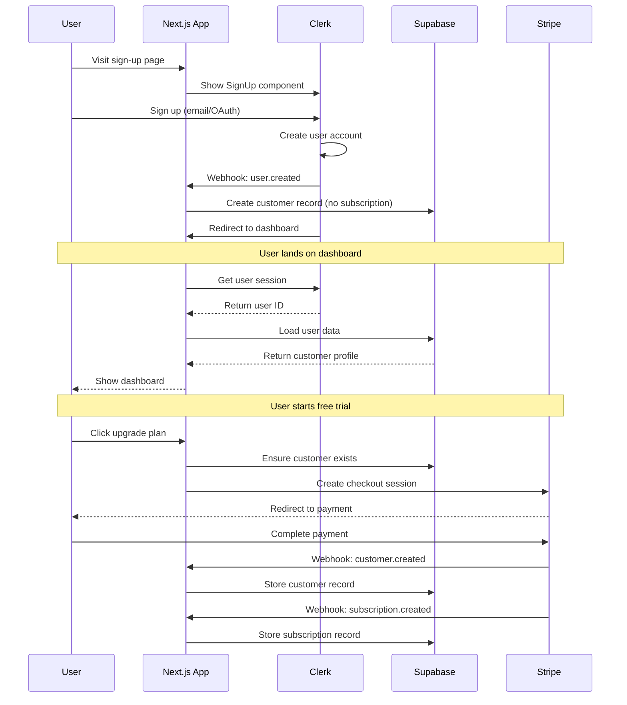
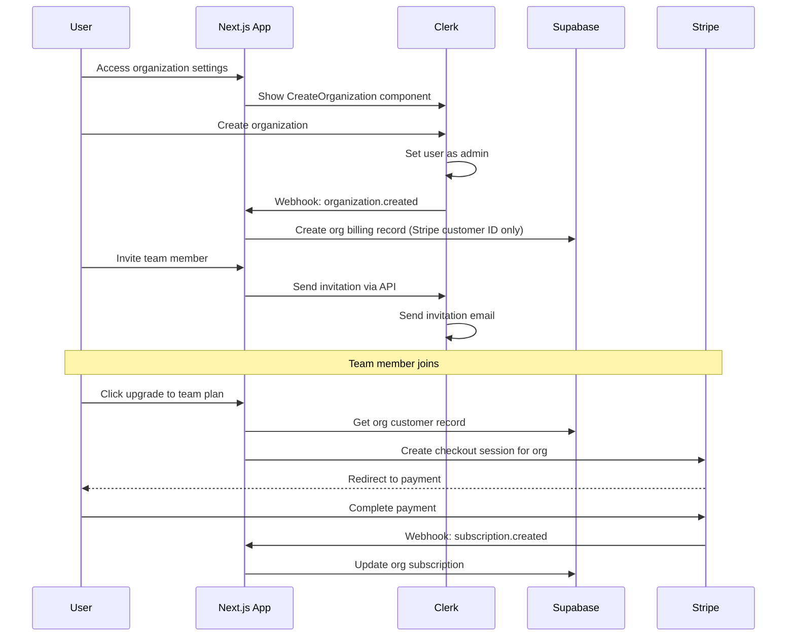
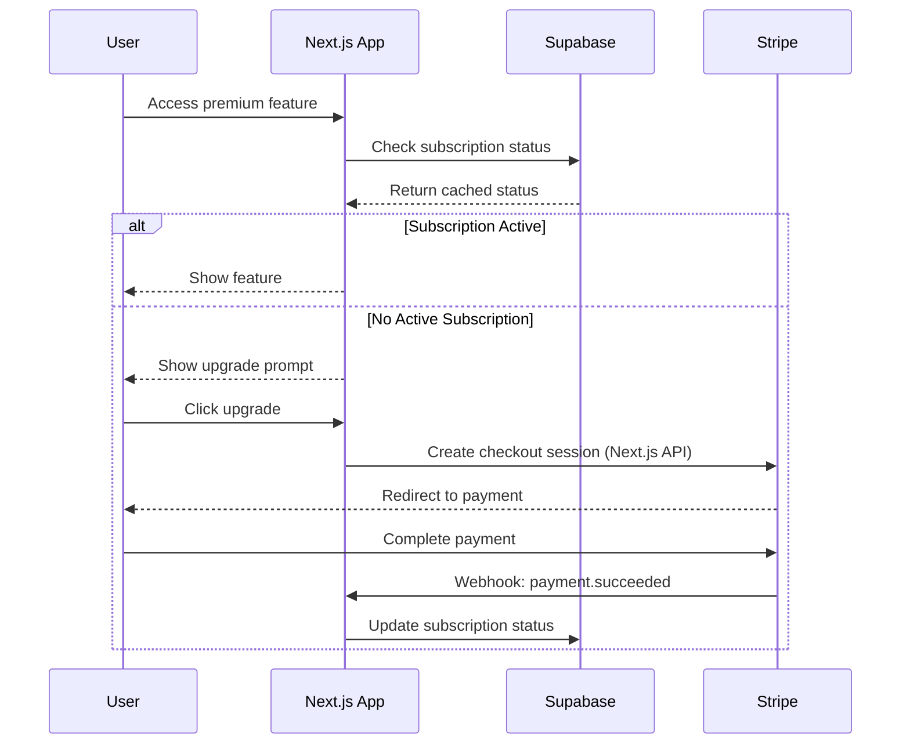

# Architecture Overview: Clerk + Stripe + Supabase

This document explains how the three main services (Clerk, Stripe, Supabase) work together to provide authentication, subscription management, and data storage for the Next.js SaaS application.

## System Architecture

```
┌─────────────┐    ┌──────────────┐    ┌─────────────┐
│    Clerk    │    │    Stripe    │    │  Supabase   │
│ (Auth & Org)│    │  (Payments)  │    │ (Database)  │
├─────────────┤    ├──────────────┤    ├─────────────┤
│• User Auth  │    │• Subscriptions│    │• User Data  │
│• Google OAuth│    │• Payment Proc│    │• Sub Status │
│• Orgs/Teams │    │• Invoices    │    │• Audit Logs │
│• Permissions│    │• Webhooks    │    │• File Storage│
└─────────────┘    └──────────────┘    └─────────────┘
       │                   │                   │
       └─────────────┬─────────────────────────┘
                     │
            ┌─────────────────┐
            │   Next.js App   │
            │  (Business Logic)│
            └─────────────────┘
```

## Service Responsibilities

### 🔐 Clerk (Authentication & Organizations)
- **Primary Role**: User authentication and organization management
- **Responsibilities**:
  - User sign-up/sign-in (email/password, Google OAuth)
  - Session management
  - Organization/team management
  - User profiles and metadata
  - Role-based permissions within organizations

### 💳 Stripe (Payment Processing)
- **Primary Role**: Subscription and payment management
- **Responsibilities**:
  - Subscription creation and management
  - Payment processing
  - Invoice generation
  - Webhook events for status changes
  - Trial period management
  - Payment method storage

### 🗄️ Supabase (Database)
- **Primary Role**: Data storage and synchronization
- **Responsibilities**:
  - Storing customer-subscription relationships
  - Caching subscription status for quick access
  - Audit logs and activity tracking
  - File storage for user uploads
  - Real-time data synchronization

## User Journey Flows

### 1. Sign-Up Flow



**Implementation Steps**:
1. **Next.js renders sign-up page**
   ```typescript
   // app/(auth)/sign-up/[[...rest]]/page.tsx
   import { SignUp } from '@clerk/nextjs'
   
   export default function SignUpPage() {
     return <SignUp />
   }
   ```

2. **Clerk webhook creates customer record**
   ```typescript
   // app/api/webhooks/clerk/route.ts
   export async function POST(req: NextRequest) {
     const { type, data } = await req.json()
     
     if (type === 'user.created') {
       await createCustomer({
         clerkUserId: data.id,
         email: data.email_addresses[0]?.email_address,
         fullName: `${data.first_name} ${data.last_name}`.trim(),
         // No stripe_customer_id yet - will be added when they subscribe
       })
     }
     
     return NextResponse.json({ received: true })
   }
   ```

3. **Dashboard loads user data**
   ```typescript
   // app/page.tsx - Dashboard component
   async function Dashboard() {
     const { userId } = await auth() // Clerk session
     const subscription = await getUserSubscription(userId) // Supabase
     return <DashboardContent subscription={subscription} />
   }
   ```

4. **Stripe checkout session** (when user upgrades)
   ```typescript
   // app/api/create-checkout-session/route.ts
   export async function POST(req: NextRequest) {
     const { userId } = await auth()
     
     // Customer already exists from Clerk webhook
     const customer = await getCustomerByClerkId(userId)
     if (!customer?.stripe_customer_id) {
       // Create Stripe customer if not exists
       const stripeCustomer = await stripe.customers.create({...})
       await updateCustomer(customer.id, { stripe_customer_id: stripeCustomer.id })
     }
     
     const session = await stripe.checkout.sessions.create({
       customer: customer.stripe_customer_id,
       // ... subscription details
     })
     
     return NextResponse.json({ sessionId: session.id })
   }
   ```

### 2. Organization Management Flow



**Implementation**:
```typescript
// Organization creation
// app/organization/page.tsx
import { CreateOrganization } from '@clerk/nextjs'

export default function CreateOrgPage() {
  return <CreateOrganization />
}

// Webhook handler for organization events
// app/api/webhooks/clerk/route.ts
export async function POST(req: NextRequest) {
  const { type, data } = await req.json()
  
  switch (type) {
    case 'organization.created':
      // Only create billing-related record (Stripe integration)
      // Organization info stays in Clerk
      await createOrgBillingRecord({
        clerkOrgId: data.id,
        stripeCustomerId: null, // Will be created when they subscribe
      })
      break
      
    case 'organizationMembership.created':
      // No need to store membership in our DB
      // Clerk handles all membership/role management
      console.log(`User ${data.public_user_data.user_id} joined org ${data.organization.id}`)
      break
  }
}

// Organization subscription upgrade
// app/api/create-org-checkout-session/route.ts
export async function POST(req: NextRequest) {
  const { userId, orgId } = await auth()
  
  // Only org admins can upgrade
  if (orgRole !== 'admin') {
    return NextResponse.json({ error: 'Unauthorized' }, { status: 403 })
  }
  
  // Get organization info from Clerk
  const organization = await clerkClient.organizations.getOrganization({ organizationId: orgId })
  
  // Get billing record from our DB
  const orgBilling = await getOrgBillingRecord(orgId)
  
  const session = await stripe.checkout.sessions.create({
    customer: orgBilling.stripe_customer_id,
    customer_email: organization.publicMetadata?.billingEmail,
    // ... team plan details
  })
  
  return NextResponse.json({ sessionId: session.id })
}
```

**Key Points**:
- **Organization Info**: Stored in Clerk (name, members, roles, metadata)
- **Billing Records**: Only Stripe customer ID stored in Supabase
- **Subscription**: One subscription per organization (not per user)
- **Permissions**: Determined by Clerk org roles + subscription tier from Supabase
- **Data Flow**: Clerk for org management → Supabase only for billing/subscription data

**Data Separation**:
```
Clerk Stores:
- Organization name, logo, settings
- Member list and roles (admin, member)
- User profiles and authentication
- Invitation management

Supabase Stores:
- Stripe customer IDs
- Subscription status and billing data
- Usage metrics and audit logs
```

### 3. Subscription Management Flow



## Permission System

### Feature Access Matrix

| Feature | Free | Business Starter | Business Standard | Enterprise |
|---------|------|------------------|-------------------|------------|
| Dashboard | ✅ | ✅ | ✅ | ✅ |
| Basic Reports | ✅ | ✅ | ✅ | ✅ |
| **Analysis** | ❌ | ✅ | ✅ | ✅ |
| **Security Audit** | ❌ | ❌ | ✅ | ✅ |
| Team Collaboration | ❌ | ✅ (5 users) | ✅ (20 users) | ✅ (unlimited) |
| API Access | ❌ | ✅ | ✅ | ✅ |
| Priority Support | ❌ | ❌ | ✅ | ✅ |

### Permission Check Implementation

```typescript
// 1. Check user authentication (Clerk)
const { userId } = await auth()
if (!userId) redirect('/sign-in')

// 2. Get subscription status (Supabase cache)
const subscription = await getUserSubscription(userId)

// 3. Check feature access (Business logic)
const hasAccess = hasAccessToFeature(subscription, 'analysis')
if (!hasAccess) {
  // Show upgrade prompt
  return <UpgradeRequired feature="analysis" />
}

// 4. Render feature
return <AnalysisPage />
```

### Role-Based Permissions (Clerk Organizations)

```typescript
// Organization role check
const { orgRole } = await auth()

// Permission levels:
// - 'admin': Full org management + billing
// - 'member': Feature access based on subscription
// - 'viewer': Read-only access

if (orgRole === 'admin') {
  // Can manage billing, invite users, etc.
} else if (orgRole === 'member') {
  // Can use features based on subscription tier
} else {
  // Read-only access
}
```

## Data Flow Patterns

### 1. Real-time Subscription Updates

```
Stripe Event → Next.js Webhook API → Supabase → Real-time UI Update
```

**Implementation**:
```typescript
// app/api/webhooks/stripe/route.ts
export async function POST(req: NextRequest) {
  const event = stripe.webhooks.constructEvent(/* ... */)
  
  switch (event.type) {
    case 'customer.subscription.updated':
      // Next.js processes the webhook and updates Supabase
      await updateSubscription(subscription.id, newStatus)
      // Supabase real-time will notify UI automatically
      break
  }
}
```

### 2. User Session + Subscription Check

```
Next.js Page Load → Clerk Auth → Supabase Query → Feature Access Decision
```

**Implementation**:
```typescript
// In Next.js page component
export default async function AnalysisPage() {
  const { userId } = await auth() // Clerk
  const subscription = await getUserSubscription(userId) // Supabase
  const hasAccess = hasAccessToFeature(subscription, 'analysis') // Business logic
  
  return hasAccess ? <AnalysisContent /> : <UpgradePrompt />
}
```

## Environment Variables

### Required Environment Variables
```bash
# Clerk Authentication
NEXT_PUBLIC_CLERK_PUBLISHABLE_KEY=pk_test_...
CLERK_SECRET_KEY=sk_test_...
CLERK_WEBHOOK_SECRET=whsec_... # For user.created webhook
NEXT_PUBLIC_CLERK_SIGN_IN_URL=/sign-in
NEXT_PUBLIC_CLERK_SIGN_UP_URL=/sign-up

# Stripe Payments
STRIPE_SECRET_KEY=sk_test_...
NEXT_PUBLIC_STRIPE_PUBLISHABLE_KEY=pk_test_...
STRIPE_WEBHOOK_SECRET=whsec_... # For subscription webhooks

# Supabase Database
NEXT_PUBLIC_SUPABASE_URL=https://xxx.supabase.co
NEXT_PUBLIC_SUPABASE_ANON_KEY=eyJ...
SUPABASE_SERVICE_ROLE_KEY=eyJ... # For webhooks only
```

## Security Considerations

### 1. Data Access Patterns
- **Frontend**: Uses Clerk session + Supabase anon key (RLS protected)
- **Stripe Webhooks**: Stripe signature verification → Next.js API Route → Supabase service_role key
- **Clerk Webhooks**: Clerk signature verification → Next.js API Route → Supabase service_role key  
- **Next.js API Routes**: Server-side Clerk authentication + business logic

### 2. Sensitive Operations
```typescript
// ✅ Correct: Next.js API Route with server-side permission check
export async function POST(req: NextRequest) {
  const { userId } = await auth() // Clerk server-side
  if (!userId) return unauthorized()
  
  const subscription = await getUserSubscription(userId)
  if (!hasAccessToFeature(subscription, 'premium-api')) {
    return forbidden()
  }
  
  // Proceed with operation
}

// ❌ Wrong: Client-side only check
const hasAccess = hasAccessToFeature(subscription, 'premium-api')
if (hasAccess) {
  await fetch('/api/premium-endpoint') // Can be bypassed
}
```

### 3. Webhook Security
```typescript
// Verify Stripe webhook signature
const event = stripe.webhooks.constructEvent(
  body,
  signature,
  process.env.STRIPE_WEBHOOK_SECRET!
)

// Use service_role key for database updates
await supabaseAdmin.from('subscriptions').update(...)
```

## Monitoring and Observability

### Key Metrics to Track
1. **Authentication**: Sign-up conversion, login success rate
2. **Subscriptions**: Trial-to-paid conversion, churn rate, MRR
3. **Feature Usage**: Feature adoption, usage by subscription tier
4. **System Health**: Webhook delivery success, database performance

### Error Handling
```typescript
// Graceful degradation
export async function getUserSubscription(userId: string) {
  try {
    return await getUserSubscriptionData(userId)
  } catch (error) {
    console.error('Subscription fetch failed:', error)
    // Return safe default
    return { plan: null, status: null, /* ... */ }
  }
}
```

## Deployment Considerations

### 1. Environment Setup
- **Development**: All services in test mode
- **Staging**: Test webhooks with ngrok/similar
- **Production**: Webhook endpoints must be HTTPS

### 2. Database Migrations
```sql
-- Use Supabase migrations for schema changes
-- Store in supabase/migrations/
```

### 3. Webhook Reliability
- Implement idempotent webhook handlers
- Use Stripe CLI for local development
- Monitor webhook delivery in Stripe Dashboard

## Troubleshooting Guide

### Common Issues

1. **User can't access premium features**
   - Check Clerk authentication status
   - Verify subscription status in Supabase
   - Confirm Stripe webhook delivery

2. **Subscription status not updating**
   - Check webhook endpoint accessibility
   - Verify webhook signature validation
   - Confirm database permissions

3. **Organization permissions not working**
   - Verify Clerk organization setup
   - Check role assignments
   - Confirm subscription is tied to organization

### Debug Commands
```bash
# Check Stripe webhook events (forward to Next.js API route)
stripe listen --forward-to localhost:3000/api/webhooks/stripe

# Check Clerk webhook events
# Set up ngrok for local development: ngrok http 3000
# Configure webhook endpoint: https://abc123.ngrok.io/api/webhooks/clerk

# Test database connection
npx supabase status

# Verify Clerk configuration
# Check dashboard.clerk.com for user sessions and webhook logs
```

This architecture provides a robust, scalable foundation for a SaaS application with clear separation of concerns and well-defined data flows between services.